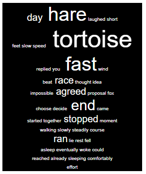

Lab 11 - Dictionaries
Questions:
1. Given D = {'a':3, 'x':7, 'r':5}:
(a) Write Python code that returns the value at key 'x'.
```py
D = {'a':3, 'x':7, 'r':5}
print(D['x'])
```
(b) Write Python code that returns the key given value '7'.
```py
for key in D.keys():
    if D[key] == 7:
        print(key)
```

2. If my_dict = {'a':15 , 'c':35, 'b':20}, write Python code:
(a) to print all the keys.
```py
print(my_dict.keys())
```
(b) to print all the values.
```py
print(my_dict.values())
```
(c) to print all the keys and values pairs.
```py
print(my_dict.items())
```
(d) to print all the keys and values pairs in order of key.
```py
list1 = [(k, v) for k, v in D.items()]
list1.sort() 
print(list1)
```
(e) to print all the keys and values pairs in order of value.
```py
list1 = [(v, k) for k, v in D.items()]
list1.sort() 
print(list1)
```
3. Write a Python script to generate and print a dictionary that contains a number (between 1 and n) in the form (x, x*x) .
```py
num_dict = {}
for num in range(1,10):
    num_dict[num] = num**2
print(num_dict)
```
4. Write a Python program to combine these two dictionaries adding values for common keys.
d1 = {'a': 100, 'b': 200, 'c':300}
d2 = {'a': 300, 'b': 200, 'd':400}
Sample output: d3 = {'a': 400, 'b': 400, 'd': 400, 'c': 300}
```py
d1 = {'a': 100, 'b': 200, 'c':300}
d2 = {'a': 300, 'b': 200, 'd':400}
d3 = {}
for key in d1.keys():
    if key in d2:
        d3[key] = d1[key] + d2[key]
    else:
        d3[key] = d1[key]
for key in d2.keys():
    if not(key in d3):
        d3[key] = d2[key]
print(d3)
```
5. Use a dictionary to create a program that prompts for an integer and prints out the integer using words. For example: 138 will print “one three eight”
```py
d_num = {'1': 'one', '2': 'two', '3': 'three','4': 'four', '5': 'five', '6': 'six','7': 'seven', '8': 'eight', '9': 'nine','0': 'zero'}
input_str = str(input('enter a integer:'))
out = ''
for i,char in enumerate(input_str):
    out = out + ' ' + d_num[char]

print(out)
```
6. Create a dictionary that maps countries to their capitals. You may start with an empty dictionary. Ask the user to input the name of the country and its capital and add them to the dictionary. E.g., capitals = {'Argentina':'Buenos Aires','France':'Paris', 'US': 'Washington D.C.'} Once the dictionary is created, print the capitals in alphabetical order.
```py
capitals = {'Argentina':'Buenos Aires','France':'Paris', 'US': 'Washington D.C.'} 
while(True):
    input_city = input('enter city:')
    input_country = input('enter country:')
    capitals[input_country] = input_city
    input_exit = input('exit?y/n, n to continue')
    if input_exit == 'y':
        break
list_c = [(v, k) for k, v in capitals.items()]
list_c.sort() 
print(list_c)
```

7. Make a word cloud. A word cloud is a visual representation for text data typically used to depict keyword metadata on websites, or to visualize free form text. An example is given below:

```html
The text of the HTML page is provided below:
<!DOCTYPE html>
<html>
<head lang="en">
<meta charset="UTF-8">
<title>Tag Cloud Generator</title>
</head>
<body>
<div style="text-align: center; width: 15%; vertical-align: middle; font-family: arial; color: white; background-color:black; border:1px solid black">
** Your SPAN elements should be inserted here **
</div>
</body>
</html>
The format of a span element is 
<span style="font-size: XXpx"> WORD </span>
where XX is the size in pixels and WORD is the word being represented.
So for example, <span style="font-size: 20px"> our </span>
```

1.	The first part will be to read the story from the hare_and_tortoise.txt file in brightspace and populate a dictionary using each word as a key, and value equals the frequency of the word. Your dictionary may look something like this:
{'tortoise': 5, 'hare': 4, 'stopped': 2, …}
2.	For each word in the dictionary of frequencies you’ll need to write a SPAN tag to your HTML file. The font size will vary depending on the frequency of the word – for example if you use count*10 to calculate the words’ size, then words that appear once will be size 10px, words that appear twice 20px, etc.
3.	You should then create the completed HTML page and write it as a .html file. You can open this file to test it using a browser of your choice.
4.	Modify your program to exclude common words from showing in the cloud. You can get a file of stopwords (e.g. a, the, this, there, etc) in brightspace.

